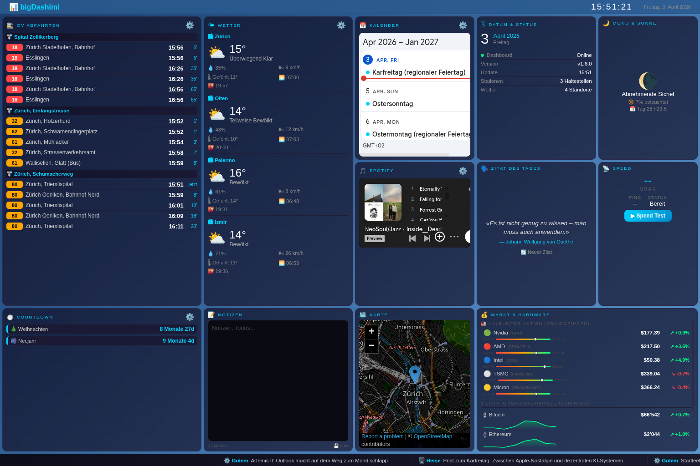

# 📊 bigDashimi

> **All-in-One IT-Dashboard** — 12 Widgets, 7 APIs, 0 API-Keys, 1 HTML-Datei.

   

## 🚀 Live Demo

**[bloondus.github.io/bigDashimi](https://bloondus.github.io/bigDashimi/dashboard.html)**

## 📸 Preview

<p align="center">
  <a href="https://bloondus.github.io/bigDashimi/dashboard.html">
    
  </a>
</p>

> 💡 **Tipp:** Für den vollen Effekt im Browser `F11` (Fullscreen) drücken!

## 🖥 Widgets

| Widget | Beschreibung | API |
|--------|-------------|-----|
| 🚉 **ÖV Abfahrten** | Live-Abfahrten mit Bus/Tram-Labels | [search.ch](https://fahrplan.search.ch) |
| 🌤 **Wetter** | Mehrere Standorte, Sonnenauf/-untergang | [Open-Meteo](https://open-meteo.com) |
| 📅 **Kalender** | Google Calendar Embed (Dark Mode) | Google Calendar |
| 💰 **Markt & Hardware** | Halbleiter-Aktien (52W-Range) + Crypto (Sparklines) + Währungen | [CNBC](https://quote.cnbc.com) · [CoinGecko](https://coingecko.com) · [Frankfurter](https://frankfurter.dev) |
| 📰 **News Ticker** | Heise, Golem, Hardwareluxx (RSS) | CORS-Proxy |
| 🎵 **Spotify** | Playlist/Album einbetten | Spotify Embed |
| 🌙 **Mondphase** | Phase, Beleuchtung, Zyklustag | Berechnung (lokal) |
| 🗣️ **Zitat** | Tägliches Zitat mit Fallback | [Quotable](https://quotable.io) |
| ⏱️ **Countdown** | Events mit Tage-Countdown | Lokal |
| 📝 **Notizen** | Auto-Save Notizblock | localStorage |
| 📡 **Speed Test** | Download-Speed & Ping | Cloudflare |
| 🗺️ **Karte** | OpenStreetMap Embed | OSM |

## ✨ Features

- 🎨 **Dynamischer Hintergrund** — Farbverlauf ändert sich mit der Tageszeit
- 🌧 **Wetter-Animationen** — Regen, Schnee, Nebel, Gewitter auf Canvas
- 📊 **Sparkline-Charts** — 7-Tage-Trend für Bitcoin & Ethereum
- 📈 **52-Wochen-Range** — Visuelle Balken für Aktien
- 🔒 **XSS-Schutz** — `sanitize()` + URL-Validation mit Host-Allowlist
- ♿ **Accessibility** — ARIA-Labels, semantisches HTML, `prefers-reduced-motion`, Focus-Visible
- 💾 **API-Caching** — localStorage mit TTL (5–30 Min pro Endpoint)
- ⚡ **Priorisiertes Laden** — P1 sofort → P4 nach 1s (kein API-Stau)
- 🔄 **Tab-Visibility** — Canvas pausiert bei verstecktem Tab
- 📱 **Responsive** — Desktop, Tablet, Mobile
- 📦 **PWA** — Installierbar als App, Offline-Support
- 💾 **Settings Export/Import** — Einstellungen als JSON sichern & wiederherstellen

## ⚙️ Einrichtung

### 1. Repository klonen & deployen

```bash
git clone https://github.com/bloondus/bigDashimi.git
cd bigDashimi/my-github-pages-site
```

### 2. GitHub Pages aktivieren

1. **Settings** → **Pages**
2. Source: **Deploy from a branch**
3. Branch: `main` / Ordner: `/ (root)`
4. **Save** → nach ~1 Minute live 🎉

### 3. Konfigurieren

Alles läuft ohne API-Keys. Einstellungen direkt im Dashboard über ⚙️:

- **ÖV-Stationen** hinzufügen/entfernen
- **Wetter-Standorte** suchen & hinzufügen
- **Google Calendar** ID eintragen
- **Spotify** Playlist-Link einfügen
- **Countdown** Events verwalten
- **Settings** exportieren/importieren als JSON

## 🖥 Kiosk-Modus (TV/Monitor)

```bash
# Linux
chromium-browser --kiosk https://bloondus.github.io/bigDashimi/dashboard.html

# Windows
start chrome --kiosk https://bloondus.github.io/bigDashimi/dashboard.html

# macOS
open -a "Google Chrome" --args --kiosk https://bloondus.github.io/bigDashimi/dashboard.html
```

## 📁 Architektur

```
dashboard.html          ← Standalone Dashboard (alles in einer Datei)
├── <style>             ← CSS Variables, Grid, Responsive, Accessibility
├── <body>              ← Semantisches HTML (main, section, footer)
└── <script>            ← 7 APIs, Caching, Canvas, Settings, PWA
manifest.json           ← PWA-Manifest
sw.js                   ← Service Worker (Cache-First)
```

**Kein Build-Step. Kein Framework. Kein API-Key. Einfach öffnen.**

## 🔧 Tech Stack

| Technologie | Verwendung |
|-------------|------------|
| Vanilla HTML/CSS/JS | Kein Framework |
| CSS Custom Properties | 24 Design-Tokens |
| Canvas API | Wetter-Animationen |
| SVG | Sparkline-Charts |
| localStorage | Settings + API-Cache |
| Service Worker | Offline-Support |
| CORS-Proxy-Kette | RSS-Feeds (codetabs → allorigins) |

## 📜 Changelog

| Version | Datum | Änderungen |
|---------|-------|-----------|
| 1.7.0 | 03.04.2026 | Screenshot im README, globaler Error-Handler, OG-Image, twitter:card large_image |
| 1.6.0 | 03.04.2026 | Smoke-Tests, LICENSE, OG Meta-Tags, README Screenshot |
| 1.5.0 | 03.04.2026 | PWA-Support, Settings Export/Import, Versionsnummer |
| 1.4.0 | 03.04.2026 | URL-Validation, ARIA + semantisches HTML, Race-Condition-Fix |
| 1.3.0 | 03.04.2026 | sanitize() überall, prefers-reduced-motion, API-Priorisierung |
| 1.2.0 | 03.04.2026 | CSS Variables, XSS-Schutz, API-Caching |
| 1.1.0 | 03.04.2026 | Sparklines, 52W-Range, CNBC API, Frankfurter Fix |
| 1.0.0 | 03.04.2026 | Initial Release |

---

Made with ☕ by [bloondus](https://github.com/bloondus)